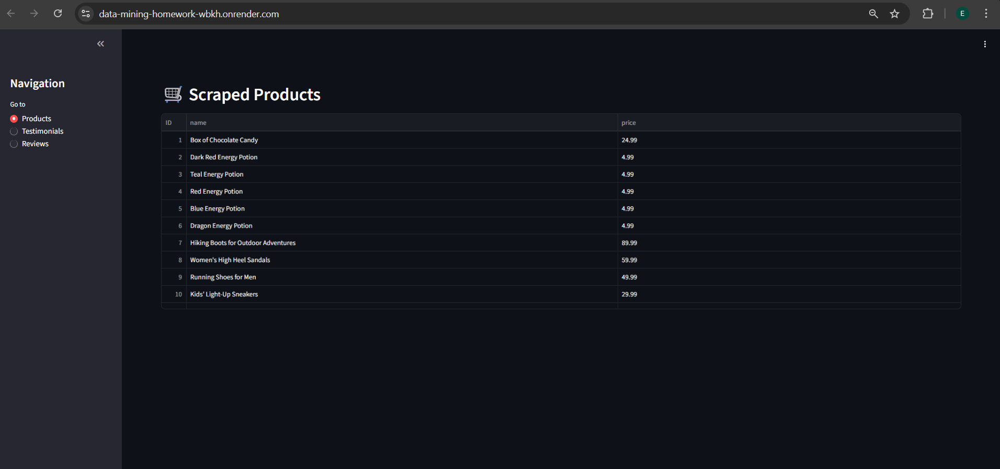
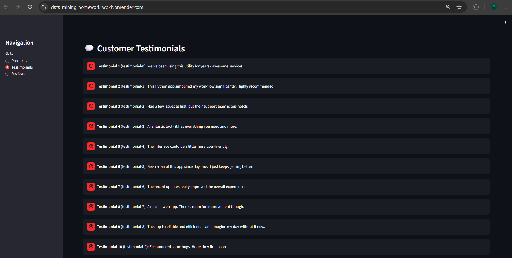
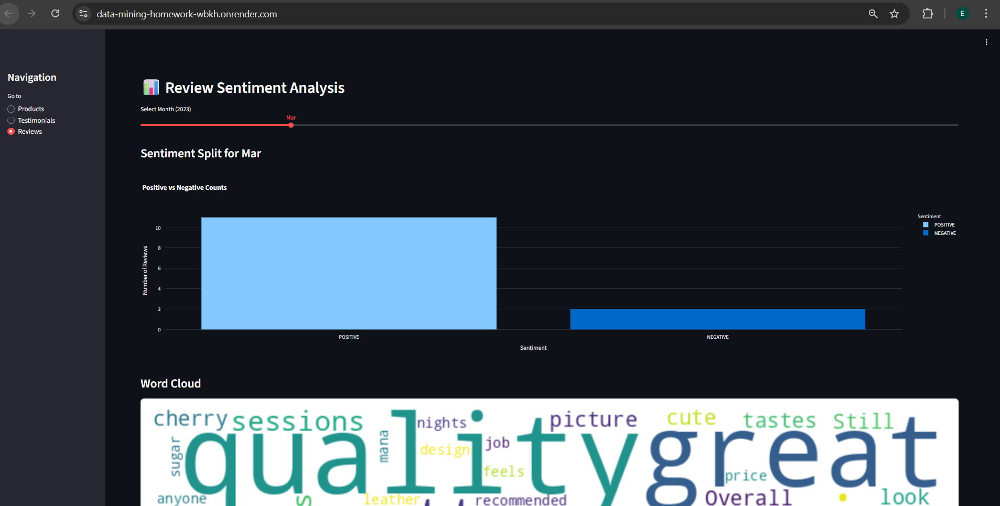

# Brand Reputation Monitoring Web App (2023)

This project is a **Python-based web application developed using the Streamlit framework**. It provides an **end-to-end solution** for a realistic business scenario in which a company monitors its **brand reputation during the year 2023**.

The application automates the collection of e-commerce data through **advanced web scraping techniques**, applies **Deep Learning–based sentiment analysis using Hugging Face Transformers**, and presents insights through an **interactive web dashboard**.

## 🌍 Live Demo

The application is deployed and publicly accessible at:  
🔗 https://data-mining-homework-wbkh.onrender.com/

## 🖼️ Application Screenshots

### 🛒 Scraped Products View

### 💬 Customer Testimonials

### 📊 Review Sentiment Analysis

## 🚀 Features

- 🌐 **Multi-Source Scraping**  
  Automated collection of:
  - Product data from static HTML pages  
  - Testimonials via REST APIs  
  - Customer reviews via GraphQL endpoints  

- 🧠 **Deep Learning Sentiment Analysis**  
  High-accuracy text classification using the `distilbert-base-uncased` transformer model from Hugging Face.

- 📅 **Chronological Filtering**  
  Interactive time slider allowing users to filter and analyze customer feedback **month-by-month for 2023**.

- 📊 **Dynamic Visualizations**  
  - Real-time bar charts with sentiment confidence scores  
  - Bonus word cloud highlighting key terms and trends  

- ☁️ **Cloud Deployment**  
  Deployed live on **Render**, enabling public access via a web browser.

## 🎯 Project Objectives

- Implement a **hybrid scraping architecture** capable of handling both static HTML pages and dynamic GraphQL APIs.
- Apply **modern NLP techniques** using Hugging Face pipelines instead of traditional rule-based sentiment libraries.
- Use **Streamlit** to bridge complex backend data processing with an intuitive frontend interface.
- Explore **Gemini AI** as a thought partner for debugging advanced GraphQL cursor logic and optimizing UI components.

## 🛠️ Technology Stack

- **Python**
- **Streamlit** – Web framework and UI
- **BeautifulSoup & Requests** – HTML and REST API scraping
- **GraphQL & Cursor-based Pagination** – Dynamic data extraction
- **Hugging Face Transformers** – Deep Learning (DistilBERT)
- **Pandas** – Data manipulation and date filtering
- **Plotly & WordCloud** – Interactive visualizations
- **Render** – Cloud deployment

## 📂 Project Structure

- `app.py` – Streamlit dashboard and AI logic  
- `scraper.py` – Data mining script (REST & GraphQL)  
- `data.json` – Scraped dataset for 2023  
- `requirements.txt` – Project dependencies  
- `runtime.txt` – Declaring Python version
- `README.md` – Documentation 

## 📝 Disclaimer

This project was developed for educational purposes only as part of an academic course.
All scraped data is used solely to demonstrate web scraping, data mining, and sentiment analysis techniques.
